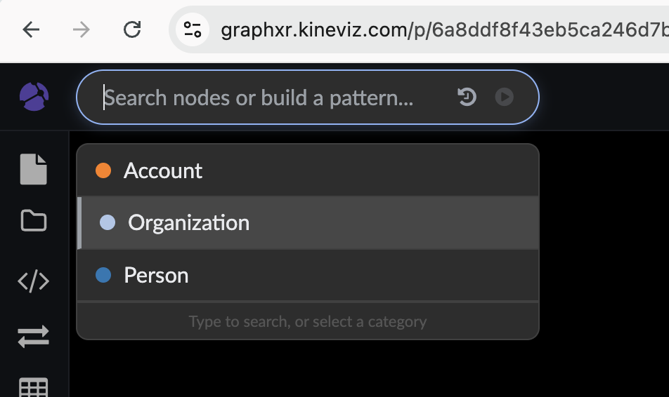
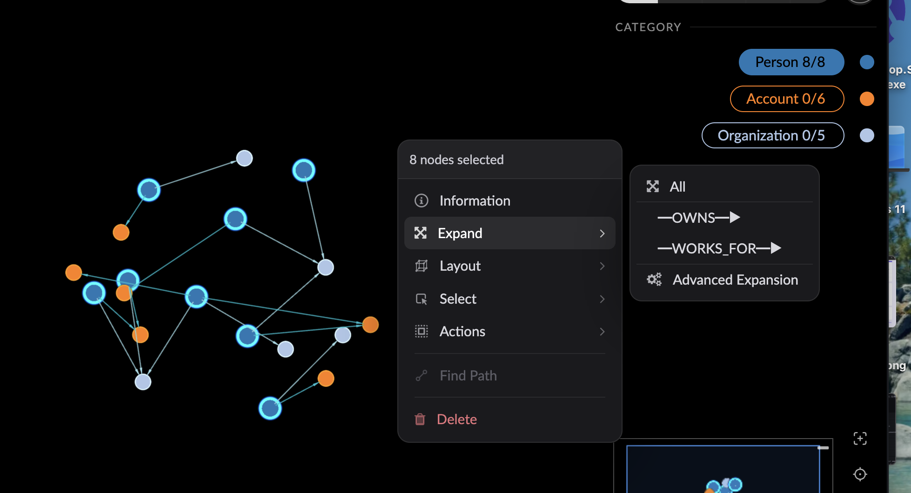
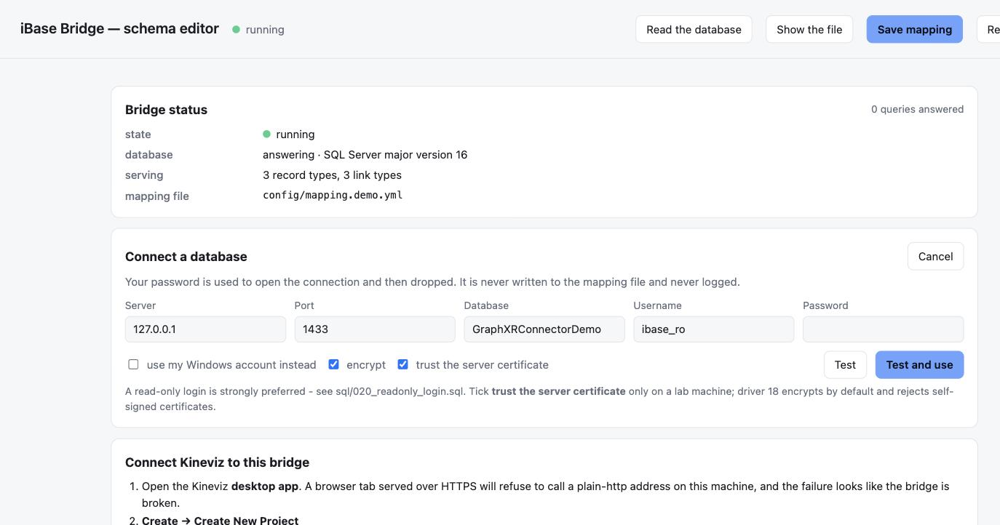
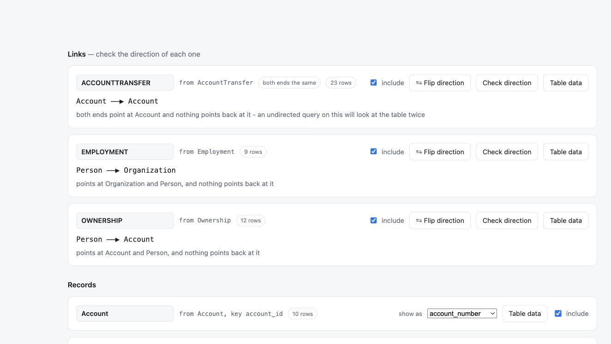
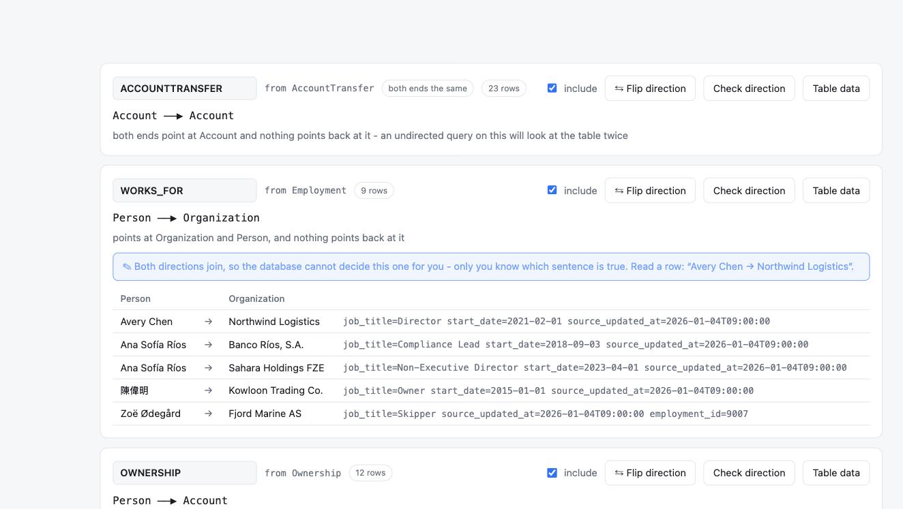
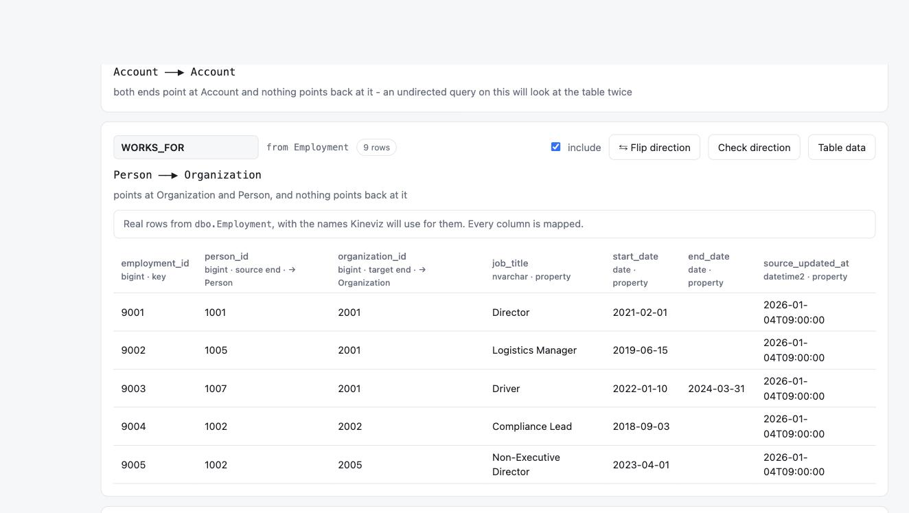

# Quick start

**Fifteen minutes, from nothing to a graph you can click around.** You need Docker, Python, and
a Kineviz account. Everything else the setup script installs. No iBase licence and no real
data either: `./setup` builds a demo database with the shapes a real one has.

Everything below was run exactly as written, against
<https://graphxr.kineviz.com/> in a browser. The numbers are the ones it returned.

---

## 1. Stand up the demo

```bash
git clone https://github.com/Kineviz/ibase-kineviz-bridge
cd ibase-kineviz-bridge
./setup
```

That starts SQL Server in Docker, builds two demo databases, creates a read-only login, and
prints the command to run the bridge. It takes a few minutes the first time, mostly downloading
SQL Server.

Run the command it printed. You should see:

```
  iBase bridge is serving 3 record types and 3 link types.

  In Kineviz: Create -> Create New Project
      Database Type:  KoreDB Via Proxy API
      Proxy API URL:  http://localhost:7073/ibase/demo
```

**What is in the demo:** 12 people, 5 organisations, 10 accounts, and the links between them:
who works for whom, who owns which account, and money moving between accounts.

---

## 2. Get Kineviz

**If you already have a Kineviz account and it is open, skip to step 3.**

**Create an account** at <https://www.kineviz.com/> if you do not have one. It is the same
account for the browser and for Desktop.

**Then pick one.** Both work, and nothing here depends on which:

| | Kineviz in the browser | Kineviz Desktop |
| --- | --- | --- |
| Where | <https://graphxr.kineviz.com/> | [download](https://github.com/Kineviz/kineviz-desktop/releases/latest) |
| To install | nothing | ~200 MB |
| Reaching the bridge on this machine | your browser asks permission once; click **Allow** | works straight away |
| Cost | account required | free for individual use, forever |

The browser is the quicker start, with nothing to download. Choose Desktop if you would rather
skip the permission prompt, or if your browser refuses rather than asks (see below).

If you want Desktop, `uname -sm` tells you which build:

| Your machine | File |
| --- | --- |
| Apple Silicon Mac | `Kineviz-Desktop-<ver>-mac-arm64.dmg` |
| Intel Mac | `Kineviz-Desktop-<ver>-mac-x64.dmg` |
| Windows | `Kineviz-Desktop-Setup-<ver>-win-x64.exe` |
| Linux (Debian/Ubuntu) | `Kineviz-Desktop-<ver>-linux-amd64.deb` |
| Linux (other) | `Kineviz-Desktop-<ver>-linux-x86_64.AppImage` |

---

## 3. Connect Kineviz to the bridge

**Create → Create New Project**, then two fields:

| Field | Value |
| --- | --- |
| **Database Type** | `KoreDB Via Proxy API` |
| **Proxy API URL** | `http://localhost:7073/ibase/demo` |

No username or password. The bridge holds the database credentials; Kineviz never sees them.

Click **Confirm**.

> **Two things that trip people up.**
>
> Pick **`KoreDB Via Proxy API`**, not `Database Proxy`. The second one fails its connection
> check because GraphXR probes it with Bolt, which cannot speak to an HTTP address.
>
> **In a browser, your browser will ask permission** the first time, because the bridge is
> running on your machine while Kineviz is served from the web. Click **Allow**. If you see no
> prompt *and* nothing loads, your browser is refusing rather than asking. Use Desktop instead.

You know it worked when the schema panel lists **3 record types** (Person, Organization,
Account) and **3 link types** (WORKS_FOR, OWNS, TRANSFERRED_TO).

---

## 4. Pull some nodes and relationships

There are two ways in. Start with the first.

### The search bar, if you would rather not write Cypher

Click **Search nodes or build a pattern…** at the top left. It offers the record types the
bridge found in your database:



Those three came from your SQL Server tables a moment ago. Pick **Person** and it becomes a
chip. The bar then offers the links leading out of it, `WORKS_FOR` and `OWNS`, and after that
the record types at the far end. Build up `Person —WORKS_FOR→ Organization`, set a small
limit, and press the **▶** at the right.

**Set the limit before you run.** It remembers what you last used rather than resetting, and a
large number on a real database pulls a graph too dense to read.

### The Query panel, when you want the exact query

Open it with the `</>` icon in the left strip, and replace what is there with:

```cypher
MATCH (p:Person)-[r:WORKS_FOR]->(o:Organization) RETURN p, r, o LIMIT 25
```

Click **Run**. The panel reports:

```
13 nodes · 9 edges · 0.10 s
```

Eight people, five organisations, nine employment links. Close the panel with the same `</>`
icon to see the graph.

**If the dots are piled on top of each other**, that is normal: a query drops everything at
the same point. Click the **Fly Out** button in the bottom toolbar (four outward arrows) to
frame the graph, and the **layout** icon in the left strip → **Force** → **Run** to spread it
out.

**What just happened underneath.** Kineviz speaks Cypher; SQL Server does not. The bridge
translated it and logged both halves side by side:

```bash
tail -1 logs/queries.jsonl | python3 -m json.tool
```

```sql
SELECT TOP (25)
    v0.[person_id] AS __gx_v0_k0, v0.[full_name] AS __gx_v0_p0, ...
    v1.[organization_id] AS __gx_v1_k0, v1.[name] AS __gx_v1_p0, ...
    e0.[employment_id] AS __gx_e0_k0, e0.[job_title] AS __gx_e0_p0, ...
FROM [dbo].[Person] AS v0
JOIN [dbo].[Employment] AS e0 ON e0.[person_id] = v0.[person_id]
JOIN [dbo].[Organization] AS v1 ON v1.[organization_id] = e0.[organization_id]
ORDER BY v0.[person_id], v1.[organization_id], e0.[employment_id];
```

Ordinary SQL. Nothing was copied or exported. That ran against SQL Server when you clicked Run.

### A few more to try

```cypher
-- everything, to see the whole demo at once
MATCH (n) RETURN n LIMIT 50

-- who owns which account
MATCH (p:Person)-[r:OWNS]->(a:Account) RETURN p, r, a LIMIT 25

-- money moving between accounts, in both directions
MATCH (a:Account)-[r:TRANSFERRED_TO]-(b:Account) RETURN a, r, b LIMIT 50

-- a table rather than a graph
MATCH (p:Person) RETURN p.full_name, p.country_code, p.risk_score
```

The last one comes back as a table rather than dots. The bridge decides which shape to return
from what you asked for.

---

## 5. Select a few nodes and expand

**Expand** asks "what else do these connect to?". You will use it more than anything else.

1. Click a **Person** dot. Shift-drag to add more, or press **Ctrl+A** to take everything.
2. Right-click one of them → **Expand**, and choose what to follow:



**All** follows every link. Or pick one: `OWNS` shows only the accounts these people own.
The legend on the right counts what is selected against what is on the canvas: `Person 8/8` here
means all eight people are selected.

Starting from the 13-node graph above and expanding **three people**:

| | before | after |
| --- | --- | --- |
| nodes | 13 | **19** |
| edges | 9 | **17** |

Six **Account** nodes appeared, joined by eight new **OWNS** links. Those people own bank
accounts, and now you can see which.

Expand again from the new Accounts and the transfers between them appear. That is the loop:
pull a little, expand, follow what looks interesting.

> **Why Expand is the query that breaks things.** Kineviz writes *every selected node's id*
> into the expand query. Select a thousand dots and the query carries a thousand ids, and SQL Server refuses
> more than 2,100 parameters in a single statement. In real captured traffic, 22% of expands
> exceeded that, and one carried 42,214 ids. The bridge sends large selections as a single JSON
> parameter instead, so this keeps working when you select the whole canvas. Try it.

---

## 6. Try the iBase-shaped database

The second demo database looks the way a real iBase database looks: one table per record type,
string record ids like `PER0000123`, endpoints in a `_LinkEnd` system table, and a link type
that joins several different kinds of record at once.

It needs its own bridge, because one bridge serves one database:

```bash
. .venv/bin/activate
export IBASE_CONNECTION_STRING='DRIVER={ODBC Driver 18 for SQL Server};SERVER=127.0.0.1,11433;DATABASE=IBaseShapedDemo;UID=ibase_ro;PWD='$(cat .ro-password)';Encrypt=yes;TrustServerCertificate=yes'
python ibase_server.py --mapping config/mapping.ibase.yml --name ibase --port 7074 --studio
```

Add a second Kineviz project pointing at `http://localhost:7074/ibase/ibase`, then:

```cypher
MATCH (a)-[r:Associate]->(z) RETURN a, r, z LIMIT 50
```

One link type, three different kinds of endpoint: Person→Person, Person→Organization,
Organization→Vehicle. The bridge runs a separate indexed query for each and merges them.

---

## 7. Point it at your own database

Everything here happens in the editor at **<http://localhost:7073/studio>**. You will not need
to write any YAML.

### Get a read-only login first

`SELECT` only, on the tables you are allowed to read. `sql/020_readonly_login.sql` creates one.
iBase schema changes go through iBase Designer, never SQL.

### Connect

**Database → Connect a different database.** Fill in server, port, database and login, then
**Test**:



```
✓ 2022 · Developer Edition (64-bit)
  Fully supported.

  version          16.0.4265.3
  compatibility    160
  tables           412
  can it write?    ● no, writes are refused
```

That last check asks the server what your login may actually do, and warns you if the account
can change data. **Test and use** switches the running bridge over, no restart. Your password
opens the connection and is then dropped; it is never written to a file. The panel prints the
`export IBASE_CONNECTION_STRING=…` line for making it permanent.

### Read the schema

Press **Read the database**. It sorts your tables into records and links:



For iBase link tables it also asks the data which record types they actually join, rather than
assuming.

Each row shows the source table, the row count, and why it guessed what it did. Untick
**include** to leave a table out.

### Name the links, and check their direction

This is the part only you can do. Type over `EMPLOYMENT` to make it `WORKS_FOR`. Then press
**Check direction**:



The editor runs the link **both ways** against your data and tells you which of four situations
you are in:

| | What it means |
| --- | --- |
| ✓ **Settled** | Only this direction returns rows. |
| ⚠ **Backwards** | This one matches nothing; flipping returns rows. Press **Flip direction**. |
| ✎ **You decide** | Both join. Read the row and pick the sentence that is true. |
| ✗ **Neither** | The table has rows but nothing matches. Key columns or prefixes are wrong. |

A backwards link returns no rows rather than an error, which is why this is worth a minute per
link rather than a guess.

### Check what each column becomes

**Table data** puts your column names next to the names Kineviz will use:



Unmapped columns are greyed out and counted. They will be invisible in Kineviz.

### Save and reload

**Save mapping** writes the YAML (previous kept as `.bak`) and refuses to write one that will
not load. **Reload bridge** applies it live. **Show the file** prints the YAML if you want to
see what your clicks built.

Your Kineviz project is now querying your own database. If the record types changed, reload the
graph in Kineviz too, because node ids move when the set of record types does.

Prefer the command line? `python -m ibase_bridge.discovery --mapping-out mapping.proposed.yml`
writes the same draft as a file to edit by hand.

---

## When something looks wrong

**<http://localhost:7073/studio>** first. It shows whether the bridge is running, whether the
database is answering, and the last query that failed, in plain words rather than a stack
trace.

Then `logs/queries.jsonl`, which pairs every Cypher query with the SQL it became.

A few behaviours to expect:

- **A query returns nothing, with no error.** Usually a link pointing the wrong way. Check it
  in the editor.
- **An error mentioning something "is not supported".** That is deliberate. The bridge refuses
  what it cannot translate (variable-length paths, `OPTIONAL MATCH`, `WITH`, `UNWIND`,
  `HAVING`, regular expressions) rather than quietly returning the wrong answer. An empty
  canvas is too easily mistaken for "nothing matched".
- **Everything is read-only.** `CREATE`, `MERGE`, `SET` and `DELETE` are refused twice over: by
  the bridge, and by the SQL login itself.
